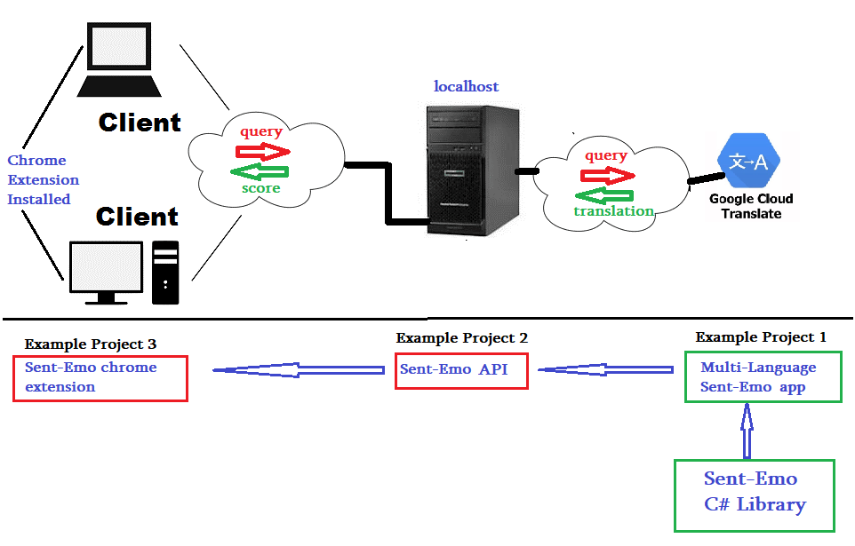
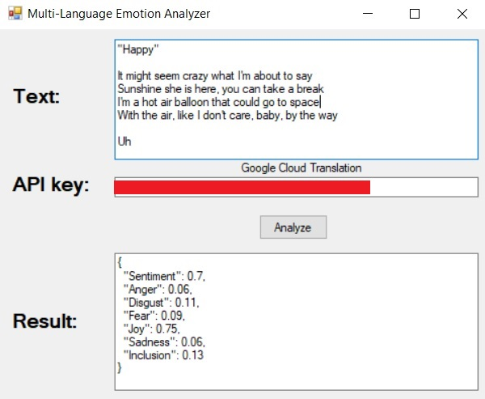
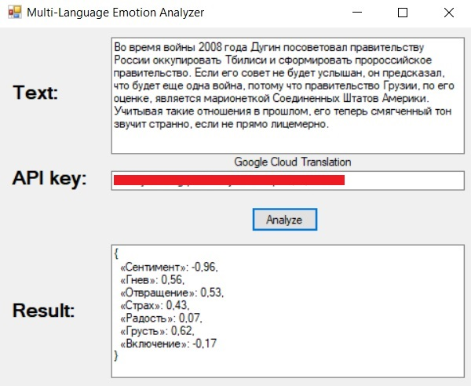
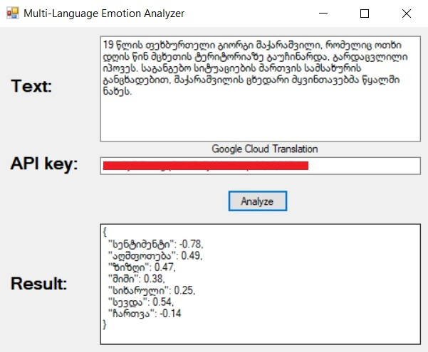

# Welcome to Sent-Emo Open Source  Project!

Sent-Emo Analyzer is open source library, which analyses given **English** text by emotion and its sentiment values. Below are the example projects and the materials used in project.


# How it Works?

```c#
using SentEmo;

SentEmoAnalyzer analyzer = new SentEmoAnalyzer();
analyzer.Initialize();
EmotionState result = analyzer.DoAnalysis("I am happy that you came, Thanks for that.");
Console.WriteLine(result.ToJson());
```
And result looks like:
```json
{
  "Sentiment": 0.7,
  "Anger": 0.06,
  "Disgust": 0.11,
  "Fear": 0.09,
  "Joy": 0.47,
  "Sadness": 0.06,
  "Inclusion": 0.13
}
```

## Example Projects
 
Based on the **sent-emo library** there is 3 project, which aims to show the sent-emo library in action:'

  1st project - completed. 
  2nd project - soon...
  3rd project - soon...

 

### Example Project 3: Sent-Emo Chrome Extension
*empty*

### Example Project 2: Sent-Emo API - localhost
*empty*

### Example Project 1: Multi-Language Translator

In spite of a fact, that library only works for english text, in this example there is Multi-Language analyzer which uses **Google Cloud Translator API** for retrieving corresponding traslation.

*Note: The Quality of Sent-Emo library evaluation decreases for non-english text scoring, but still reflects "correct evaluation". For more information about see last section*

|  |  |
|--|--|
|  |  |


## How accurate are the scores?
*empty*

## 3rd Party Resources

* [Apache OpenNLP](http://opennlp.apache.org/) - We use OpenNLP library for dividing each sentence, by speech parts and its semantic values
*  English words data organized with emotion score by [saif.mohammad](https://saifmohammad.com/WebPages/NRC-Emotion-Lexicon.htm)
